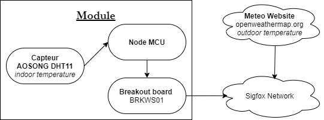
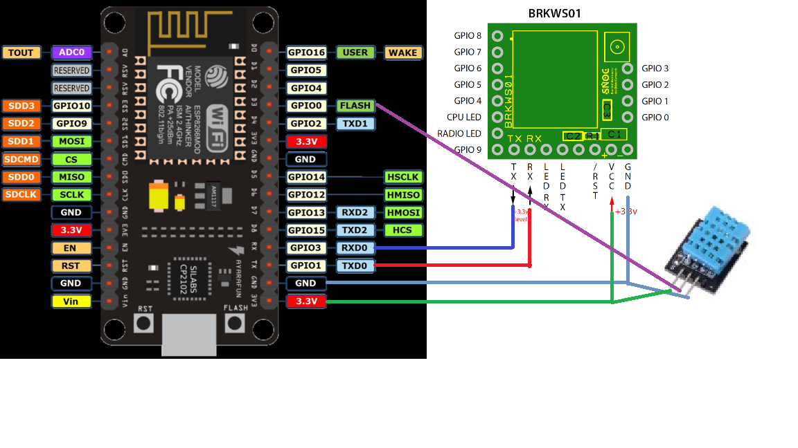

Rapport de projet d'IoT : Faire une station météo avec sigfox.
=============================================================

## Participant.

### Grégoire de Mentque,
### Jérémy Cledelin,
### Simon Frémont,

Hardware.
-------- 
* NodeMCU 1.0
* SNOC Breakout Board - Sigfox BRKWS01
* AOSONG DHT11 - Temperature and Humidity Sensor

Software.
--------
* Arduino IDE
* ESP8266 board et lib pour Arduino IDE
* Apache2

Hardware pinout.
---------------
* ### NodeMCU


* ### SNOC Breakout Board - Sigfox BRKWS01


Wiring NodeMCU with BRKWS01.
---------------------------
BRKWS01 utilise UART, donc on a utilisé Software Serial avec le NodeMCU. On utilisé les pins D7 (GPIO 13) et pins D8 (GPIO15).

* Pin D7 - GPIO 13 - Rx
* Pin D8 - GPIO 15 - Tx

___________________________________________________________________________________________________________________________________

SigFox modem module ID et PAC number.
-------------------------------------

Pour communiquer avec le SigFox modem, on utilise UART. Cela permet la communication entre le modem sigfox et le MCU.
Device ID est un id unique pour le module.


Partie Open Weather.
--------------------

* Choix d'OpenWeatherMap : Nous avons utiliser cet API pour nous donner les données météo car il a été vu en cours et que savons comment cela fonctionne

* Nous avons affiché les résultats grâce a VueJs, qui a été vu en cours.

Grâce à la clé fournie par le site, nous pouvons avoir la météo du lieu où nous sommes. Nous affichons le tout sur une page HTML. 

Partie Donnée locale.
---------------------

* On récuère les données du capteurs à savoir tempérarture et humidité.
* Nous avons décidé d'utiliser Sigfox pour que l'ensemble de nos données locales soient accessibles partout (comme les données de l'API) et donc de pouvoir créer une application qui fonctionne partout.
* On transmet les données sur le réseau sigfox en tant que message.
* On met en place une fonction de callback qui écrit les données reçu dans un json.
* On lit la donnée du json et on affiche sur la page html.


Partie Code :
-----------

````HTML
<!DOCTYPE html>
<html>
<head>
  <meta http-equiv="content-type" content="text/html; charset=UTF-8">
  <title>Weather App</title>

  <link rel="stylesheet" href="externe.css" />
  <meta http-equiv="content-type" content="text/html; charset=UTF-8">
  <meta name="robots" content="noindex, nofollow">
  <meta name="googlebot" content="noindex, nofollow">
  <meta name="viewport" content="width=device-width, initial-scale=1">


  <script
    type="text/javascript"
    src="/js/lib/dummy.js"
    
  ></script>

    <link rel="stylesheet"  href="externe.css">
</head>
<body>
	<script src="https://unpkg.com/vue/dist/vue.js"></script>
	<script src="https://cdn.jsdelivr.net/vue.resource/1.0.3/vue-resource.min.js"></script>
	</script>
	<script type="text/javascript">//<![CDATA[

    window.onload=function(){
      
var weather = new Vue({
        el: '#weather',

        data: {
            dataExterne: []
        },

        mounted: function () {
            this.getDataExterne();  
        },        

        methods: {
            getDataExterne: function () {
                this.$http.get('https://api.openweathermap.org/data/2.5/weather?lon=3.066667&lat=50.633333&APPID=52faa11a930c72cf181a31f9aabf8c00&units=metric&lang=fr')
                          .then(response => {
                             this.dataExterne = response.data
                          })
            }
        }
    })
    ;
    var weather = new Vue({
        el: '#interne',

        data: {
            dataInterne: []
        },

        mounted: function () {
            this.getDataInterne();
        },        

        methods: {

            getDataInterne: function () {
                this.$http.get('http://35341161.eu.ngrok.io/')
                          .then(response => {
                             this.dataInterne = response.data
                          })
            }
        }

    })
    ;
    }

  </script>

<header><span class="titre"> <h3>
Weather App
</h3></span> </header>

<p>
<h2>
affichage:
</h2>
</p>


 
 <div id="weather">
   
    
    
        <li>Ville : {{ dataExterne.name }}</li>
        <li>Temperature : {{ dataExterne.main.temp }} °C</li>
        <li>Humidity : {{ dataExterne.main.humidity }} % </li>
        <li>Temps : {{ dataExterne.weather[0].description }}</li>     
    
</div> 

<div id="interne">
    
        <li>Ville : {{ dataInterne.name }}</li>
        <li>Temperature : {{ dataInterne.data }} °C</li>
        <li>Humidity : {{ dataInterne.main.humidity }} % </li>
        <li>Temps : {{ dataInterne.weather[0].description }}</li>     
    
</div> 
  
  <script>
    // tell the embed parent frame the height of the content
    if (window.parent && window.parent.parent){
      window.parent.parent.postMessage(["resultsFrame", {
        height: document.body.getBoundingClientRect().height,
        slug: "sonyjp9m"
      }], "*")
    }

    // always overwrite window.name, in case users try to set it manually
    window.name = "result"
  </script>
</body>
<footer>
  Grégoire de Mentque  / Simon Frémont  /  Jérémy Cledelin
</footer>
</body>

</html>


````


## Schéma du fonctionnement


## Schéma hardware


